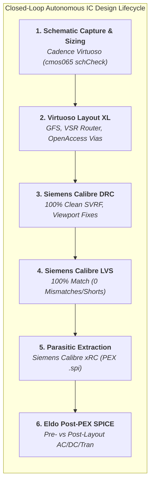
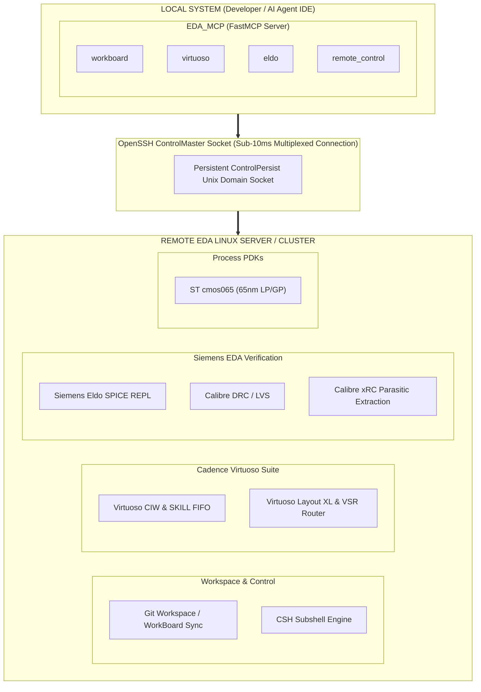
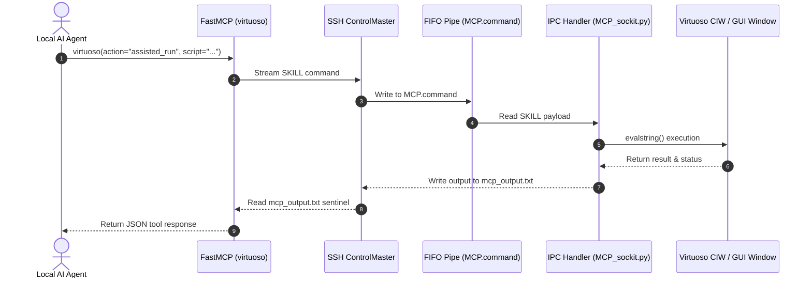
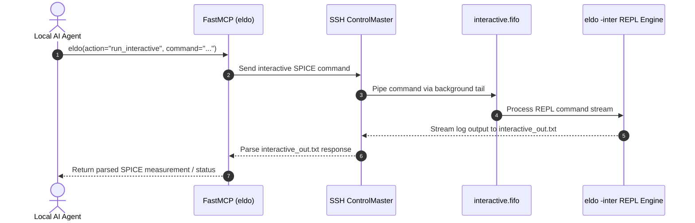
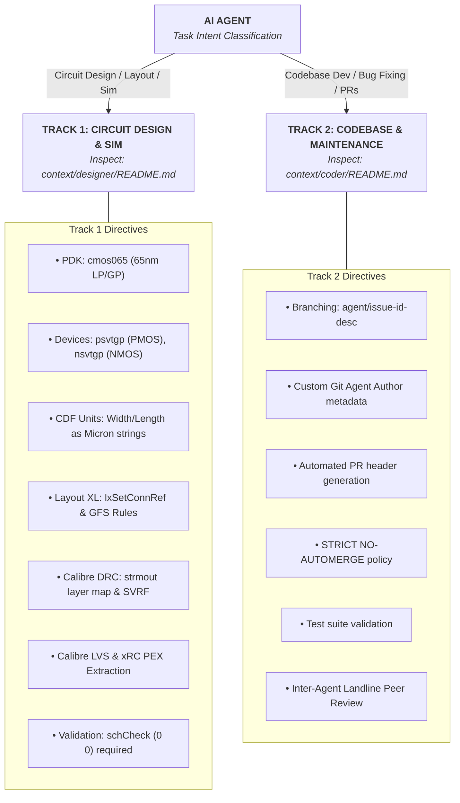

# EDA_MCP: Agentic Full-Flow EDA Control Plane & Autonomous Chip Design Workspace

[](https://www.python.org/)
[](LICENSE)
[](https://modelcontextprotocol.io/)
[]()
[]()
[]()
[]()

> **Transforming AI Coding Agents into Autonomous Silicon & IC Design Engineers.**  
> `EDA_MCP` is a high-performance Model Context Protocol (MCP) server that connects local AI IDEs and agents (Antigravity, Cursor, Windsurf, Claude Desktop, Claude Code) directly to remote Linux EDA compute clusters executing Cadence Virtuoso and Siemens Eldo.
> 
> Through `EDA_MCP`, AI agents autonomously execute the **complete, closed-loop IC design lifecycle**—from schematic capture and PDK transistor sizing to Layout XL generation, Calibre DRC physical verification, Calibre LVS equivalence checking, Calibre xRC parasitic extraction (PEX), and post-layout analog SPICE simulation verification.

---

## 📹 Demo Video

<video src="https://github.com/user-attachments/assets/091cc42f-4188-4e31-8d5c-49ad20e18e45" autoplay loop muted playsinline controls width="100%"></video>

*(Video Source: [`doc/media/demo.mp4`](file:///Users/vs/function/EDA_MCP/doc/media/demo.mp4))*

💡 **Experiment & Solve Real-World IC Design Problems**: Use `EDA_MCP` to interactively build custom integrated circuits, run physical layout verification pipelines, perform SPICE simulations, and solve silicon design challenges.  
🎓 **Live Demonstration**: The video demonstration above showcases an AI agent interactively constructing, transistor sizing, CDL netlisting, and simulating a **depletion-load inverter** live inside Cadence Virtuoso and Siemens Eldo.

---

## ⚡ Full-Flow Autonomous Silicon Engineering Capabilities

> [!IMPORTANT]
> **Verified Full-Flow Baseline (Issue #53 CheckPoint Milestone)**: `EDA_MCP` empowers AI agents to execute complete end-to-end silicon design flows autonomously. In a single continuous session, an AI agent can build a multi-stage analog/digital block, layout physical silicon, resolve design rules, verify layout-versus-schematic (LVS) match, extract 700+ parasitic R/C elements, and validate post-layout analog performance.

Here is the complete suite of silicon engineering tasks AI agents can perform through `EDA_MCP`:



### 1. 📐 Schematic Capture & PDK Sizing (`Virtuoso`)
- **Automated Schematic Generation**: Programmatically builds complex analog and digital schematics (Op-Amps, logic gates, bias networks, bandgaps) inside Cadence Virtuoso.
- **Foundry PDK Device Sizing**: Drives $65\text{nm}$ LP/GP transistor sizing (`psvtgp`, `nsvtgp`) with exact micron width/length parameters ($W, L$) and executes foundry CDF callbacks (`DK_mosInit`).
- **Zero-Warning ERC Validation**: Programmatically executes `schCheck`, strictly enforcing 0 errors and 0 warnings (`(0 0)`) before netlist compilation.

### 2. 🎨 Virtuoso Layout XL Generation & Optimization (`Layout XL`)
- **Connectivity-Bound Application Launch**: Programmatically opens Layout XL tiers (`lxSetConnRef` $\rightarrow$ `deOpen` in `"Layout XL"`) with active schematic correspondence and cross-probing.
- **Generate From Source (GFS)**: Automates device instantiation, Metal 1 pin retargeting, net binding (`lxGenerateStart` / `lxSetNetPinSpecs` / `lxGenerateFinish`), and Metal 1 drawing enclosure compliance (`M1.PIN.CAD.1`).
- **Advanced Silicon Layout Practices**: Programmatically places OpenAccess standard vias (`M1__PO`, `M1__NW`, `M1__PT`), snaps coordinates to the $5\text{nm}$ manufacturing grid, builds continuous dual-tap straps (`LUP.D.1_LUP.D.2`), and optimizes diffusion geometries.
- **Automated Placement & Routing**: Invokes Virtuoso Layout XL analog placement (`nclAnalogQuickPlaceLikeSchemCB`) and Virtuoso Space-Based Routing (`VSR`) engines.

### 3. 🔍 Physical Verification (Siemens Calibre DRC)
- **Headless GDSII Stream-Out**: Programmatically streams layout GDSII files (`strmout`) using official PDK layer maps (`cmos065.layermap`) and case preservation.
- **Hierarchical SVRF Control**: Authors custom SVRF decks (`drc.svrf`), handles leaf-cell density rules (`ALL_DENSITY_CHECK`), and executes `calibre -drc -hier`.
- **Real-Time Virtuoso Viewport Debugging**: Converts nanometer database coordinates to user microns, pans the Virtuoso GUI canvas (`hiPan`), highlights error markers (`dbCreateMarker`), and applies surgical layout fixes to achieve 100% clean DRC reports.

### 4. ⚖️ Layout-Versus-Schematic (Siemens Calibre LVS)
- **Automated Netlist Extraction**: Programmatically extracts structural SPICE netlists from schematic databases and physical GDSII geometry.
- **100% Equivalence Verification**: Executes Siemens Calibre LVS, verifying 0 mismatches, 0 short circuits, 0 open circuits, and 0 device parameter discrepancies between schematic and layout.

### 5. ⚡ Parasitic Extraction (Siemens Calibre xRC / PEX)
- **Full Transistor & Interconnect Extraction**: Executes Siemens Calibre xRC (`calibre -xrc -pdb -rcc`) to calculate parasitic resistance ($R$) and capacitance ($C$) networks across all metal and via layers.
- **Post-Layout Extracted SPICE Decks**: Generates detailed `.pex.spi` subcircuits capturing hundreds of parasitic components (e.g. 793 total parasitics: 347 R, 446 C in a $65\text{nm}$ Op-Amp layout).

### 6. 📊 Siemens Eldo Analog SPICE Simulation (Pre-Layout vs Post-Layout PEX)
- **Interactive & Batch SPICE Engine**: Manages continuous interactive SPICE REPL streams (`eldo -inter`), truncates logs, and parses `.extract` measurement reports.
- **Post-Layout Parasitic Verification**: Simulates extracted PEX decks (`.include "<cell>.pex.spi"`) alongside pre-layout schematics to measure real-world silicon degradation:
  - **Small-Signal AC Analysis**: DC open-loop gain ($A_{v0}$), $-3\text{dB}$ bandwidth ($f_{-3\text{dB}}$), Gain Bandwidth Product ($GBW$), Phase Margin ($PM$).
  - **DC Transfer Sweeps**: Input offset voltage ($V_{\text{os}}$), output swing limits ($V_{\text{OH}}, V_{\text{OL}}$).
  - **Transient Step Response**: Large/small signal step response, positive/negative slew rates ($SR_+, SR_-$), settling time.
  - **Power & Noise**: Static/dynamic power consumption, input-referred noise spectral density.
  - **Multi-Corner PVT Sweeps**: Automated simulation across process corners (`typNtypP`, `minNminP`, `maxNmaxP`, `maxNminP`, `minNmaxP`).

### 7. 🗂️ Git-Backed Workspace Synchronizer (`WorkBoard`)
- **Local-Remote Workspace Synchronization**: Tracks remote Linux EDA cluster files in local Git repositories (`./workboard/<name>/`).
- **Safe Delta Diffing**: Computes unified line-by-line diffs before committing edits back to remote servers, preventing file corruption and enabling full rollback history.

### 8. 🤖 Autonomous Bug Reporting & Inter-Agent Peer Review (`agent-landline`)
- **Self-Healing Meta-Harness**: Submits detailed GitHub issue reports (`report_issue`) with auto-attached execution logs, agent headers, and session IDs.
- **Inter-Agent Landline Communication**: Enables Coder and Designer agents to communicate, peer-review code, and verify edge cases across active sessions using `agent-landline`.

---

## 💡 Why EDA_MCP? Thoughtful Workspace Technology

Modern Integrated Circuit (IC) design demands high-performance Linux compute clusters hosting multi-gigabyte EDA tool suites (Cadence Virtuoso, Siemens Eldo) and proprietary PDKs (e.g. `cmos065`). However, AI developer tools and LLM agents operate locally inside modern IDEs.

`EDA_MCP` bridges this divide with an ultra-lightweight, resilient architecture built on 6 foundational pillars:

1. ⚡ **Sub-10ms SSH Multiplexing Engine**: Eliminates SSH handshake overhead by using persistent OpenSSH `ControlMaster` unix domain sockets and streaming file transport ([`ssh_client.py`](file:///Users/vs/function/EDA_MCP/src/core/ssh_client.py) & [`scp_client.py`](file:///Users/vs/function/EDA_MCP/src/core/scp_client.py)).
2. 🗂️ **Git-Backed WorkBoard Workspace (`workboard`)**: Local-remote workspace synchronizer that mirrors, tracks, versions, and computes unified line-by-line diffs for remote EDA files locally before pushing edits back to the cluster ([`workboard_client.py`](file:///Users/vs/function/EDA_MCP/src/clients/workboard_client.py)).
3. 🎨 **Window-First Live GUI & Virtuoso IPC (`virtuoso`)**: Drives Cadence Virtuoso schematic, Layout XL, and SKILL execution live inside an open GUI window or non-graphical session via named FIFO pipes (`MCP.command`) and IPC socket handlers ([`virtuoso_client.py`](file:///Users/vs/function/EDA_MCP/src/clients/virtuoso_client.py)).
4. ⚡ **Interactive Eldo SPICE Engine (`eldo`)**: Manages continuous interactive SPICE REPL streams (`eldo -inter`), truncates logs, parses `.extract` measurement reports, and runs batch simulation decks ([`eldo_client.py`](file:///Users/vs/function/EDA_MCP/src/clients/eldo_client.py)).
5. 📊 **PyQtGraph SPICE Waveform Oscilloscope**: Features [`eldo_plotter.py`](file:///Users/vs/function/EDA_MCP/src/clients/eldo_plotter.py), a multi-pane interactive waveform visualizer supporting `.raw` and `.spi3` SPICE transient analysis files with linked time axes, dynamic signal legends, and crosshair readouts.
6. 🤖 **Autonomous Dual-Track Context Router (`eda-mcp-context-router`)**: Equips AI agents with strict domain specs ([`context/designer`](file:///Users/vs/function/EDA_MCP/context/designer/README.md) for circuit design, Layout XL, Calibre DRC & PDK rules, [`context/coder`](file:///Users/vs/function/EDA_MCP/context/coder/README.md) for server maintenance & GitHub PR workflows), plus an agent-to-agent bug reporting pipeline (`report_issue`).

---

## 🏛️ System Architecture



### IPC Data Flow Architectures

#### 🎨 Cadence Virtuoso Named Pipe FIFO Architecture



#### ⚡ Siemens Eldo Interactive SPICE Architecture



---

## 🚀 Tool Reference & Capabilities Matrix

`EDA_MCP` exposes 5 specialized tool modules via FastMCP:

| Tool Module | Key Actions | Description & Primary Use Case |
| :--- | :--- | :--- |
| **`workboard`** | `initialize`, `add`, `pull`, `push`, `export`, `diff`, `status`, `history` | **Workspace Synchronizer & Version Control.** Tracks remote EDA files in local Git repositories under `./workboard/<name>/`. Computes line-by-line unified diffs before updating remote cluster files. |
| **`virtuoso`** | `assisted_run`, `run`, `start_standalone`, `run_standalone`, `exit`, `run_terminal_command` | **Cadence Virtuoso SKILL & Layout XL Control.** Executes SKILL scripts live in Virtuoso GUI (`assisted_run`) or non-graphical session (`start_standalone`). Handles Layout XL generation, PDK rules, and `schCheck` `(0 0)` validation. |
| **`eldo`** | `start_interactive`, `run_interactive`, `run_script`, `visualize_waveforms`, `run_terminal_command` | **Siemens Eldo SPICE Simulation Engine.** Runs batch `.cir` simulations, streams interactive SPICE REPL commands, parses `.extract` metrics, and launches waveform plotting for pre- and post-layout PEX decks. |
| **`remote_control`**| `run_command`, `read_file`, `write_file` | **Stateful CSH Subshell Engine.** Executes terminal commands, Calibre DRC/LVS batch scripts, GDSII stream-out (`strmout`), and inspects remote cluster files in persistent environment sessions (`/cadence/cshrc`). |
| **`report_issue`** | `report_issue` | **Autonomous Meta-Harness Reporter.** Agent-to-agent bug & feature request submission directly to GitHub with auto-attached execution logs, agent headers, and session IDs. |

---

## 🤖 Agent Directives & Dual-Track Context Routing

`EDA_MCP` includes the `eda-mcp-context-router` directive, enabling AI agents to autonomously inspect domain specifications before execution:



* 📘 **Designer Context Guide**: [`context/designer/README.md`](file:///Users/vs/function/EDA_MCP/context/designer/README.md)
  * 📐 [Schematic Flow](file:///Users/vs/function/EDA_MCP/context/designer/schematic_flow.md)
  * 🎨 [Layout XL Flow](file:///Users/vs/function/EDA_MCP/context/designer/layout_xl_flow.md)
  * 🔍 [Calibre DRC Flow](file:///Users/vs/function/EDA_MCP/context/designer/calibre_drc_flow.md)
  * ⚡ [Eldo Simulation Guide](file:///Users/vs/function/EDA_MCP/context/designer/eldo_simulation_guide.md)
* 📙 **Coder Context Guide**: [`context/coder/README.md`](file:///Users/vs/function/EDA_MCP/context/coder/README.md)

---

## 🛠️ Installation & Setup

### 1. Requirements
* Python 3.10 or higher
* OpenSSH client on local system
* Remote Linux server access with Cadence Virtuoso, Siemens Eldo, and Siemens Calibre installed

### 2. Install Dependencies
```bash
pip3 install -r requirements.txt
```

### 3. Setup Configuration
Copy and configure JSON config templates inside the [`config/`](file:///Users/vs/function/EDA_MCP/config) directory:
```bash
cp config/config_remote_control.json.template config/config_remote_control.json
cp config/config_virtuoso.json.template config/config_virtuoso.json
cp config/config_eldo.json.template config/config_eldo.json
cp config/config_scp.json.template config/config_scp.json
```

Example configuration ([`config/config_remote_control.json.template`](file:///Users/vs/function/EDA_MCP/config/config_remote_control.json.template)):
```json
{
  "ssh_host": "eda-uni",
  "ssh_config_path": "~/.ssh/config",
  "env_setup_cmd": "source /cadence/cshrc"
}
```

### 4. Enable SSH Connection Multiplexing (Sub-10ms Speeds)
Add the following snippet to your local `~/.ssh/config`:
```sshconfig
Host eda-uni
    HostName eda.university.edu
    User chip_designer
    ControlMaster auto
    ControlPath ~/.ssh/control-%r@%h:%p
    ControlPersist 15m
```

---

## 🔌 AI Client Configuration

### Claude Desktop
Add to `claude_desktop_config.json`:
```json
{
  "mcpServers": {
    "eda-mcp": {
      "command": "python3",
      "args": [
        "/absolute/path/to/EDA_MCP/server.py"
      ]
    }
  }
}
```

### Antigravity IDE / Cursor / Windsurf
Add a Stdio MCP server entry:
* **Server Name**: `EDA_MCP`
* **Command**: `python3`
* **Args**: `/absolute/path/to/EDA_MCP/server.py`

### Claude Code CLI
```bash
claude mcp add eda-mcp -- python3 /absolute/path/to/EDA_MCP/server.py
```

---

## 📊 SPICE Waveform Visualizer (`eldo_plotter.py`)

`EDA_MCP` includes a high-performance PyQtGraph waveform oscilloscope for transient SPICE simulation analysis:

```bash
python3 src/clients/eldo_plotter.py --file path/to/simulation.raw
```

**Features:**
- Multi-pane subplot rendering for voltage and current signals.
- Dynamic signal value labels following crosshairs in real time.
- Synchronized multi-pane X-axis zooming and panning.
- Automatic parse support for Eldo `.raw` and `.spi3` binary/ASCII formats.

---

## 📂 Repository Blueprint

| File / Directory | Description |
| :--- | :--- |
| [`server.py`](file:///Users/vs/function/EDA_MCP/server.py) | FastMCP server entrypoint & backward-compatibility shim |
| [`src/server.py`](file:///Users/vs/function/EDA_MCP/src/server.py) | Modular FastMCP server definition & tool registration |
| [`src/clients/workboard_client.py`](file:///Users/vs/function/EDA_MCP/src/clients/workboard_client.py) | Git-backed workspace engine & `.workboard.json` tracking |
| [`src/clients/virtuoso_client.py`](file:///Users/vs/function/EDA_MCP/src/clients/virtuoso_client.py) | Cadence Virtuoso SKILL IPC pipe & REPL manager |
| [`src/clients/eldo_client.py`](file:///Users/vs/function/EDA_MCP/src/clients/eldo_client.py) | Siemens Eldo SPICE simulation REPL & `.extract` parser |
| [`src/clients/eldo_plotter.py`](file:///Users/vs/function/EDA_MCP/src/clients/eldo_plotter.py) | PyQtGraph SPICE waveform oscilloscope visualizer |
| [`src/core/ssh_client.py`](file:///Users/vs/function/EDA_MCP/src/core/ssh_client.py) | Low-level persistent SSH transport with `csh` sentinels |
| [`src/core/scp_client.py`](file:///Users/vs/function/EDA_MCP/src/core/scp_client.py) | OpenSSH high-speed binary file transfer engine |
| [`src/issue_reporter.py`](file:///Users/vs/function/EDA_MCP/src/issue_reporter.py) | Meta-harness autonomous GitHub issue reporter |
| [`config/`](file:///Users/vs/function/EDA_MCP/config) | Configuration templates for SSH and tool setups |
| [`context/designer/`](file:///Users/vs/function/EDA_MCP/context/designer/README.md) | Operational specs for schematic, layout, DRC, LVS, PEX & Eldo |
| [`context/coder/`](file:///Users/vs/function/EDA_MCP/context/coder/README.md) | Operational specs for server maintenance, agent landline & PRs |
| [`doc/`](file:///Users/vs/function/EDA_MCP/doc/architecture_and_gotchas.md) | Deep-dive technical architecture and gotchas guides |
| [`tests/`](file:///Users/vs/function/EDA_MCP/tests) | Comprehensive unit and integration test suite |

---

## 🧪 Testing & Verification

Run the unit test suite:
```bash
python3 -m unittest discover tests
```
or with `pytest`:
```bash
pytest tests/
```

---

## 📜 Contributing & License

* 🤝 **Contributing & Agent Guidelines**: See [`CONTRIBUTING.md`](file:///Users/vs/function/EDA_MCP/CONTRIBUTING.md) for full Designer & Coder AI Agent contribution directives.
* 📜 Distributed under the **MIT License**. See [`LICENSE`](file:///Users/vs/function/EDA_MCP/LICENSE) for details.
